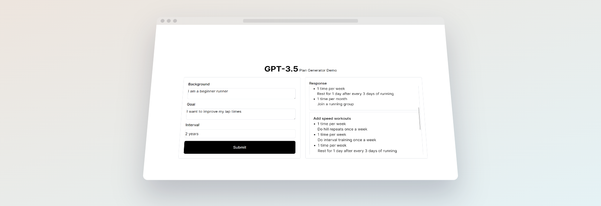

# gpt-goal-mentor
This is a simple web app that uses the chat gpt to generate a step-by-step plan for your goals.

# Features

Get a plan for your goal:

Input:
- Short user background
- Goal
- Time interval that you want to complete the goal

# Getting Started
## Deploy your own

Deploy the example using [Vercel](https://vercel.com?utm_source=github&utm_medium=readme&utm_campaign=next-example):

[](https://vercel.com/new/git/external?repository-url=https://github.com/jacobschwantes/gpt-goal-mentor)
 

Alternatively you can set up a local development environment.

## How to use


```bash
git clone https://github.com/jacobschwantes/gpt-goal-mentor gpt-goal-mentor
npm install
npm run dev
```
# Contributing

## Create a bug report

If you see an error message or run into an issue, please [open an issue](https://github.com/jacobschwantes/gpt-goal-mentor/issues). This effort is valued and it will help the project improve.

## Submit a feature request

If you have an idea, or you're missing a capability that would make development easier and more robust, please [Submit feature request](https://github.com/jacobschwantes/gpt-goal-mentor/issues).
